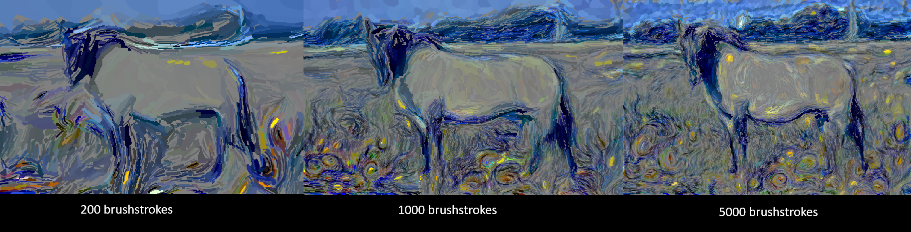

# Brushstroke Parameterized Style Transfer

Reimplementation of Kotovenko et al.: [Rethinking Style Transfer: From Pixels to Parameterized Brushstrokes](https://arxiv.org/pdf/2103.17185)



## ----- All experiment results are in the `results/` folder -----

## Quickstart (Single rendered image)

1. Install dependencies:

```bash
pip install -r requirements.txt
```

2. Open and run `jupyter_notebooks/brushstrokes.ipynb`

## Batch Experiments (render many images)

### 1) Set up deception-score assets (~1 GB)


```bash
python3 download_sanakoyeu.py
```

Rename the `evaluation_data/` folder to `deception_score_vgg/`.


### 2) Run either:
- `jupyter_notebooks/end_to_end_experiments.ipynb`
- `jupyter_notebooks/end_to_end_experiments_1000_2500_5000.ipynb`


## Outputs

- Per-run images: `results/`
- Run-level metrics CSV: `results/experiments_XX/metrics.csv`
- Aggregate summary + plots: `results/experiments_XX/aggregate_summary.csv` and `results/experiments_XX/*.png`